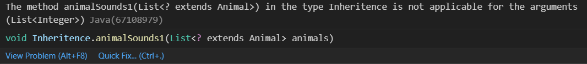
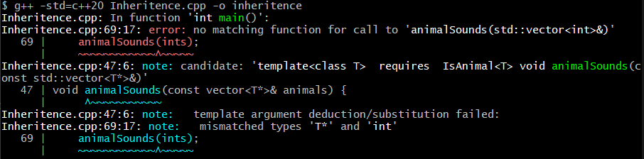

# Generic Functions and Classes in C++

## Introduction: Recap of Generics

Let us recall what parametric polymorphism (also known as generics) is. Parametric polymorphism allows us to write functions or classes without specifying a specific data type so that we can apply them to various data types without code repetition. 

Let us recall how these generics in Java look like:
- Generic functions in Java: to create a generic function in Java we must include angled brackets with one or more variables to specify generic types. For example, let us look at the function demoGenerics. With generics in Java, demoGenerics can take Lists of any types, including two Lists of different types. For instance, we could call demoGenerics with List<String>, List<Integer>, or both!
```
 public static <T, U> String demoGenerics(List<T> lst1, List<U> lst2) {
        if (lst1.size() > lst2.size()) {
            return "yes";
        } else {
            return "no";
        }}
  ```
- Generic classes in Java: Similarly, generic java classes, in our declaration of the name of our class we can add angled brackets to specify generic types. With java generics for classes, we can create objects with the same methods and data members, just using different types, but without repeating the code. The example below, can create an object that holds 2 lists of strings, or ints, or some other data type!
```
 public class TwoD<T>
 {
     public List<T> x;
     public List<T> y;
     TwoD(List<T> val1, List<T> val2)
     {
         x = val1;
         y = val2;
     }
     public void swap()
     {
         List<T> temp = x;
         x = y;
         y = temp;
     }
     public void replacex(List<T> newx){
         x = newx;
     }
 }
```
>###### *Note: all types used in generics must be non-primitive types. More detail will be provided on why when we talk about what happens at compile time.*

## Introduction to Templates: Generics in C++

### Template Functions

We saw how we were able to create generic functions in Java, and now we want to know if there is an equivalent way to do this in C++. The answer is yes. template is a keyword in C++, and when we place it before a function it turns it into a generic function. The syntax to create a generic function is template <typename T, …>. Similarly to Java, we use the angled brackets to specify our generic type. 

>###### *Note: T can be any valid name, which for C++ means it begins with a letter or an underscore, and contains only letters, digits, or underscores (not special characters or whitespaces). Valid names also exclude any reserved keywords. However, conventionally, type names have no underscores, start with a capital letter, and each new word also starts with a capital letter.*

Let us see how the generic function in Java from before would look like in C++:
```
template <typename T, typename U>
string demoGenerics(vector<T> lst1, vector<U> lst2){
    if (lst1.size() > lst2.size()) {
        return "yes";
    } else {
        return "no";
    }}
```
To see this in action, let us look at some concrete examples using these functions. We will create three lists:
```
vector<int> int1 = {1, 2, 3};
vector<int> int2 = {1, 2, 3, 4, 5};
vector<string> string1 = {"aaa", "bbb", "ccc", "ddd"};
```
Thanks to generics, not only can we call demoMultGenerics(int1, int2) on the same data type to compare the lengths of the two lists, but we can also call demoMultGenerics(int2, string1)! This is great because we can use the same code to compare the lengths of lists of different types without having to rewrite code.

>###### *Note: Unlike Java, which specify that data types used with Generics must be non-primitive, we can pass any data type into the generic function, including basic data types, derived data types, and user defined data types. More information about why will be provided when we talk about what happens at compile time.*

#### Overloading Template Functions
Overloading, or ad-hoc polymorphism, as we’ve learned in CSCC24, allows us to create functions with the same name that can do different things in their body. Overloading works similarly in C++ as in Java, as they are both explicitly typed languages, the function signature depends on not only the function name, number of params, but also on the type of the parameters.

What happens then, with overloading functions that are defined generically? 
Consider the example above with an additional function 
```
string demoGenerics(vector<int> lst1, vector<int> lst2){
    return "Demo overloading!";
}
```
Now, when I call demoGenerics(int1, int2), what will the result be? 
"Demo overloading!" will be returned!

Despite demoGenerics(int1, int2) also matching the function signature for the template demoGenerics, the compiler resolves the overloading by having non-template functions take precedence. So, if we were to call demoGenerics(int1, string1), it does not match any other function signature except for the template demoGenerics, so that is the function that applies.

### Template Classes
Creating generic classes in C++ is very similar to how we created generic functions. Once again, we use template. By having template<typename T, …> preceding any class, it becomes a generic class. 
Below is a basic example of a template class that is equivalent to the java generic class shown in the introduction. Its constructor takes in two vectors and assigns them to x and y respectively. There are 2 more additional functions, one that swaps the x and y vectors, and one that replaces the x vector with a different one.

    template <typename T>
    class TwoD
    {
    public:
        vector<T> x;
        vector<T> y;
        TwoD(vector<T> val1, vector<T> val2)
        {
            x = val1;
            y = val2;
        }
        void swap()
        {
            vector<T> temp = x;
            x = y;
            y = temp;
        }
        void replacex(vector<T> newx)
        {
            x = newx;
        }
    }

Let’s see some example usage of this. To actually use this class, just like how we saw in functions and how java generics work, we call the name of the class and provide in angled brackets the type we want to replace all instances of T with. 

In our main function, we first instantiated two objects, one object with 2 int vectors {1, 2, 3, 4, 5}, {6, 7, 8}, and one object with 2 string vectors {"abcd", "efg"}, {"qrs", "tuv", "wx", "yz"}. See below how we substituted T with int and string when referring to the type of our object. 

    TwoD<int> myints({1, 2, 3, 4, 5}, {6, 7, 8});
    TwoD<string> mystrings({"abcd", "efg"}, {"qrs", "tuv", "wx", "yz"});
We can also apply the swap function to either of these objects, as well as the replacex function. Let's try swapping the x and y for the integer object, and replacing the x for the string object, depicted below.

    myints.swap();
    mystrings.replacex({"hijk", "lm", "no", "p"});

At each step, we will output each of the objects, and below is the result.

    myints is:
     x:[ 1 2 3 4 5 ], y:[ 6 7 8 ]
    mystrings is:
     x:[ abcd efg ], y:[qrs tuv wx yz ]
    myints after swapping:
     x:[ 6 7 8 ], y:[ 1 2 3 4 5 ]
    mystrings after replacing x:
     x:[ hijk lm no p ], y:[ qrs tuv wx yz ]

Which is exactly what we wanted! Now we only needed to create 1 class instead of multiple for this type of object we wanted to make (holds 2 vector data members, can swap the x and y, and can replace the x vector).

Additionally, within a template class, one can use both generic types, and also existing concrete types. So we can have generic data members as well as concrete data members as well as concrete functions and  generic functions. Furthermore, can have more than one template parameter. We can see another example on the below, with these complexities. This class represents 2 vectors, with an id attached to them.

    template <typename T, typename U>
    class TwoVec
    {
    public:
        int id;
        vector<T> x;
        vector<U> y;
    
        TwoVec(int newid, vector<T> val1, vector<U> val2)
        {
            x = val1;
            y = val2;
            id = newid;
        }
        void replacexy(vector<T> otherx, vector<U> othery)
        {
            x = otherx;
            y = othery;
        }
        void changeid(int newid)
        {
            id = newid;
        }
        void addid(int other)
        {
            id += other;
        }
    }

As we can see in the above class, it holds 2 generic data types, and 1 non generic data type (int). It also has a generic function replacexy and two non-generic functions changid and addid. This is perfectly fine in C++, and everything works as expected. Here is an example usage of this class.

    TwoVec<int, string> multi(1234, {12, 34, 5, 6789}, {"foo", "bar", "foobar"});

We instantiated our object multi to have instead of generic types, a vector of ints and a vector of strings. 

    multi.replacexy({123}, {"foobar"});
    multi.addid(1111);
    
We then made some changes by calling replacexy and addid to replace the two vectors with 2 new ones, and add 1111 to the existing id in multi. Below, we can see the outputs as expected.

    multi is:
    id: 1234
    x:[ 12 34 5 6789 ], y:[ foo bar foobar  ]
    new multi is:
    id: 2345
    x: [ 123 ], y: [ foobar ] 

Note that this TwoVec class is very similar to the above class TwoD, but there is an important difference between them. Despite the type "T" shown in the class TwoD being a generic type, we cannot make x and y of different types as they are both type "T" in the class, and once instantiated, will still have to remain the same type. 

Let's see what will happen if we try to create an object of class TwoD with x being an int and y being a string. For show, let's try it with both T being int and T being string; regardless they will end up with the same errors.

    TwoD<string> IntsAndStrings1({123}, {"foo"});
    TwoD<int> IntsAndStrings2({123}, {"foo"});
Attempting to run this, results in an error


Since the constructor for class TwoD expects 2 arguments of the same type, T, despite T being generic and being able to be any type, it cannot be different types in the same instance.

This is different with the TwoVec class, where now we can, as demonstrated, put both vectors of ints and strings inside (but we can also put two of the same type as well). However, there is now a different issue where we can not make certain functions like the swap function in TwoD. This is because the swap function as depicted simply switches the vectors for our x and y value. That worked in TwoD, since the x and y were of the same vector type, however, since the type of x and y are different in TwoVec, this cannot be done. 

If we used the earlier multi object again as an example, x would have a type of vector<int> and y would have a type of vector<string>, so if we tried to swap them we would then be declaring that x with a value of a string vector is of type vector<int> which would not be true. If we try to add in the swap function, it will not cause an error, but if we attempted to use call it with the object multi, the below error occurs.


What this is saying is that there is an error in the swap function as there is no operator definition of "=" for a vector<string> and a vector<int>.

## Inheritance with Templates
For this concept, let’s first define a general example. Say we have classes for a Dog and a Cat. Each class is a subclass of Animal (so a Dog and a Cat is an Animal). How can we incorporate subclassing in generics in Java?
A pure generic function would look like this:
```
public static <T> void animalSounds(List<T> animals) {
        for(int i = 0; i < animals.size(); i++) {
            System.out.println(animals.get(i).sound());
        }}
```
However, we only want this to print the sound if T is an animal. Just using the generic T is a little too broad for our liking. To try and only print animal noises, our first approach would be to only allow lists of Animal.
```
public static void animalSounds(List<Animal> animals) {
        for(int i = 0; i < animals.size(); i++) {
            System.out.println(animals.get(i).sound());
        }}
```
However, if we pass a List<Cat> (list of cats) into the function, although Cat is a subclass of Animal, List<Cat> is not an instance of List<Animal>. In Java, the way to solve this problem is to utilize wildcards. As a reminder, a wildcard in Java is specified by the symbol ‘?’. These were only used in functions, and the huge advantage of them is that it allowed us to write a function with greater flexibility. Unlike T, we can extend ?, which allows us to put constraints on what types of data types would be allowed. Now, our improved function looks like this:
```
public static void animalSounds1(List<? extends Animal> animals) {
        for(int i = 0; i < animals.size(); i++) {
            System.out.println(animals.get(i).sound());
        }}
```
With wildcards, we can pass a List<Cat>, List<Dog>, List<Animal>, or any other subclasses that are instances of Animal! If we create a list with type T where T is not a subclass of Animal, it will throw a compile-time error:


The natural question now is does C++ have an equivalent way to create animalSounds1 so that only animal types get passed? Unfortunately, there is no direct equivalent of ? in C++, but we can utilize Constraints and Concepts, which are features for C++20. Constraints are conditions that template arguments must adhere to in order to use the specific code that defined the constraint. The set of requirements is what is called a Concept. Concepts are predicates, and when T is provided at compile time, it returns a truth value. The format of a concept is:
```
template <typename T [,...]>
concept concept-name = constraint-expression::value;

template <concept-name T>
{ function code here }
```
>###### *Note: constraint-expression can be a conjunction (&&), disjunction (||), or atomic constraints. For more information, check out the link in the souces.
Now, in our template, we can utilize the concept to restrict types to only be ones that meet the conditions of the respective concept concept-name refers to.
Let us now create the animalSounds1 function in C++ using concepts:
```
template <typename T>
concept IsAnimal = is_base_of<Animal, T>::value;

template <IsAnimal T>
void animalSounds(const vector<T*>& animals) {
    for (const auto& animal : animals) {
        cout << animal->sound() << endl;
    }}
```
Here, we is_base_of constraint checks if T is a subclass of Animal. If T is a subclass of Animal (is_base_of value is true), then we can create an instance of the function with type T. If, however, T is not a subclass of Animal, the compiler will throw an error and will not create an instance of the function with type T.


## Compilation of Templates
For the most part, Java and C++, both of which are Object Oriented languages, have similar ways of implementing parametric polymorphism. However, one big difference between the two is what happens at compile time.

First let's look at Java. Java uses type-erasure, which means that each time that the generic function or class is called, at compile time it is equivalent to if the generic type parameters were replaced with Object. Looking back at the function example in Java, at compile time it would look like this:
```
public static String demoMultGenerics(List<Object> lst1, List<Object> lst2) {
if (lst1.size() > lst2.size()) { return "yes";
} else { return "no";}}
```
Templates, on the other hand, generate new concrete functions or classes each time the template is called during compile time. It is almost like direct substitution and replaces all instances of that typename with the intended type, and then at run-time we no longer have the template, but rather the function or class with whatever type it was called with. Looking back at the function example in C++, at compile time it would look like this:
```
int demoGenerics(vector<int> lst){
    return lst.size();
}
int demoGenerics(vector<string> lst){
    return lst.size();
}
```
When we call demoGenerics(int1) and demoGenerics(string1), what the compiler does is replaces the template with
Because every time we call these generic functions, it creates a concrete instance based on the calling data type, this can cause the code’s size to become bloated, meaning that the code becomes relatively large. However, the advantage is that there is 100% type safety since each data type now has an explicit function/ class at runtime instead of all sharing a general function/ class.

## Conclusion: Recap of C++ Templates
As we have learned, using generics in C++ is very similar to what we have seen before in Java. However, instead of utilizing the angles within the function/class declaration, we put template<typename T, …> before our function/class declaration. We can specify multiple generic different types, in that template declaration, and utilize a mixture of both concrete data types and generic types in our class or function.  Additionally, overloading can still be done as normal, but the compiler will also choose to use non-template functions over template functions. Concepts also allow us to put restrains on what data types should be allowed to create an instance of a function. When utilizing the generics, the compiler will generate new classes with the actual types we input, which can possibly bloat up our executable, but it provides more type-safety by truly distinguishing between different usages of the template classes.

## Sources
- Polymorphism: CSCC24 Slides and Lectures by Professor Anya Tafliovich
- C++ Templates: https://en.cppreference.com/w/cpp/language/templates
- Overloading Functions with Templates: https://www.ibm.com/docs/en/i/7.4?topic=only-overloading-function-templates-c
- Constrains and Concepts: https://en.cppreference.com/w/cpp/language/constraints
- Compilation: https://medium.com/coding-blocks/templates-in-c-vs-generics-in-java-3f820e633821
- Abstract classes in C++: https://en.cppreference.com/w/cpp/language/abstract_class
- C++ Type Traits: https://cplusplus.com/reference/type_traits/is_base_of/
- Java Wildcards: https://docs.oracle.com/javase/tutorial/extra/generics/wildcards.html


